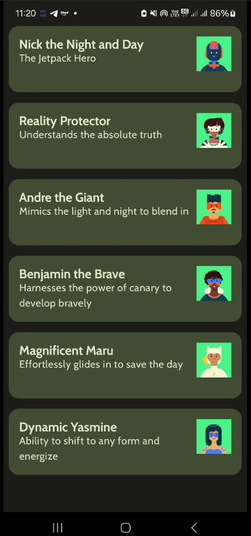

# SuperHeroes App 🦸‍♀️🦸‍♂️

Este projeto é parte do curso [Android Basics with Compose](https://developer.android.com/courses/pathways/android-basics-compose-unit-3-pathway-3), desenvolvido pelo Google. O objetivo da atividade é praticar os conceitos de **layouts em Jetpack Compose**, compondo uma lista de cards com informações sobre super-heróis fictícios.

## 📚 Conteúdo praticado

Durante o desenvolvimento deste app, foram aplicados os seguintes conceitos:

- Uso de `LazyColumn` para listas eficientes e com rolagem.
- Componente `Card` com personalização de cores e dimensões.
- `Modifier` para controle de **padding**, **margens**, **tamanho** e **layout responsivo**.
- Utilização de recursos (`stringResource`, `painterResource`) para textos e imagens.
- Organização da UI com `Row`, `Column` e `Box`.
- Aplicação do **Material 3** com temas e cores personalizadas.
- Tratamento adequado de `WindowInsets` com `enableEdgeToEdge()` para compatibilidade com status bar e navigation bar.

## ✨ Funcionalidade

O aplicativo exibe uma lista de super-heróis, onde cada item contém:

- Nome do herói
- Descrição
- Ícone representativo (imagem drawable)

Cada item é mostrado em um **Card** com estilo visual consistente, respeitando as práticas de design do Material.

## 🛠️ Tecnologias utilizadas

- **Kotlin**
- **Jetpack Compose**
- **Material 3**
- **Android Studio**
- API 24+

## 📸 Capturas de tela

> 

## 🚀 Como executar

1. Clone o repositório:
   ```bash
   git clone https://github.com/seu-usuario/superheroes-compose.git
